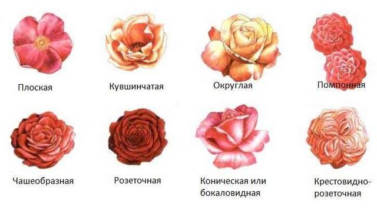

### Классификация роз для новичков
__Что вы знаете о розах?__

> «Роза – королева цветов и царица ароматов» - расскажут ценители прекрасного.

>«Белая роза означает любовь и чистоту. Красная роза – это пламенная любовь. Желтая – символ измены и разлуки» - ответят романтичные натуры.

__А что скажут садоводы?__

Роз существует огромное количество. Для удобства они объединены в группы, и в каждой из них много сортов. На сегодняшний день в мире их известно более 25 000. И ежегодно мировые питомники выводят новые сорта. Как ориентироваться во всем этом многообразии, если вы начинающий розовод? Наша статья поможет:

разобраться, какие группы роз существуют;
научиться определять сорт своих роз;
понять, какие сорта роз пригодны для нашего климата;
выбрать подходящий сорт роз для вашего сада
Читателям с небольшим садоводческим стажем рекомендуем сначала прочитать эту статью, а потом уже перейти к большому каталогу всех сортов. 
Итак, начинаем.

Различают типы цветков по количеству лепестков. Здесь все просто.

* Простой – менее 8 лепестков.
* Полумахровый – 8-20 лепестков
* Умеренно махровый – 21-29 лепестков
* Среднемахровый – 30-39 лепестков
* Густомахровый – более 40 лепестков
* Форма цветка также бывает разная:

Продолжить чтение статьи можно [по ссылке](https://www.biosfera-kazan.ru/blogs/blog/klassifikatsiya-roz-dlya-novichkov)

